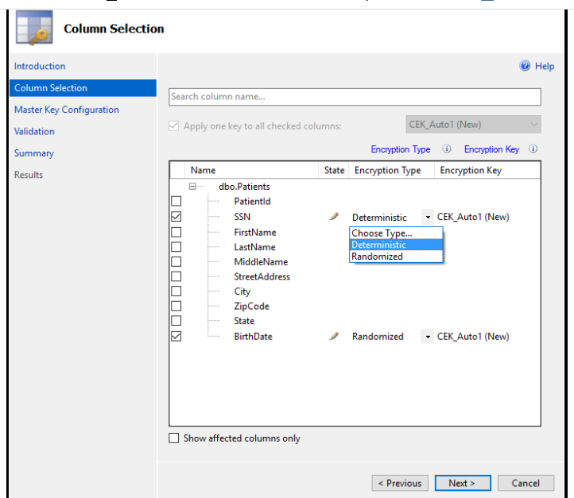

## Azure sql database

Azure sql database is a database PAAS service.


### Security

#### Data encryption

##### Always encrypted

Encrypts data at rest, motion (transfer between client and server) and in use (RAM).

Always encrypted ensures that you never see the plain text in the database until unless you have access to the Column master key (CMK) & Column encryption key(CEK).

Store the keys in Azure key vault/ windows certificate store.

There are two type of encryption method
 * Deterministic
   The same value should be encrypted with same encrypted value. This is useful for lookup, joining and filtering.
 * Random
   It produces the different encrypted value for the same column value.
   
   
   Steps to encrypt column
   
   * Set up azure key vault
   * set up database and table
   * configure service principal or user to access the key value with the right access policy - get,list,wrap,unwrap.
   * configure the field required to encrypt by specifing the encrypted method and encryted algorithm (CEK)
   * configure the store(Keyvault / windows store) to save CMK.
   
   
   
   
   
   
   
   
   
   
   #### Dynamic Data Masking
   
   DDM is a feature available in Sql server and Azure sql database.
   
   It protects sensitive information in the table without modifying the underlying data. This means it masks the data in the query result.
   
   This gives additional and complements other protection techniques (encryption,rowlevel security,auditing..)
   
   There are four types of DDM and it is configured via T-SQL
   
   default - replace all character to 4 xxxx or less if it has less than 4 character
   email - shows first and suffix .com  eg axxxx@xxx.com
   random - it generates random number. this support only numerical value.
   custom string - it expose first and last letters and add custom padding string in the middle
   
   * permission - you should have create and alter table permission
   
   This is very useful as user can't see the actual values but however they can update values.
   
   Create DDM table
   ```sql
   CREATE TABLE Membership  
   (MemberID int IDENTITY PRIMARY KEY,  
   FirstName varchar(100) MASKED WITH (FUNCTION = 'partial(1,"XXXXXXX",0)') NULL,  
   LastName varchar(100) NOT NULL,  
   Phone varchar(12) MASKED WITH (FUNCTION = 'default()') NULL,  
   Email varchar(100) MASKED WITH (FUNCTION = 'email()') NULL);  
  
   INSERT Membership (FirstName, LastName, Phone, Email) VALUES   
   ('Roberto', 'Tamburello', '555.123.4567', 'RTamburello@contoso.com'),  
   ('Janice', 'Galvin', '555.123.4568', 'JGalvin@contoso.com.co'),  
   ('Zheng', 'Mu', '555.123.4569', 'ZMu@contoso.net');  
   SELECT * FROM Membership;  
  ```

Grant user to acces table

  ```sql
   CREATE USER TestUser WITHOUT LOGIN;  
   GRANT SELECT ON Membership TO TestUser;  

   EXECUTE AS USER = 'TestUser';  
   SELECT * FROM Membership;  
   REVERT;  
```
UnMask User

```sql 
GRANT UNMASK TO TestUser;  
EXECUTE AS USER = 'TestUser';  
SELECT * FROM Membership;  
REVERT;   
  
-- Removing the UNMASK permission  
REVOKE UNMASK TO TestUser;  
```
