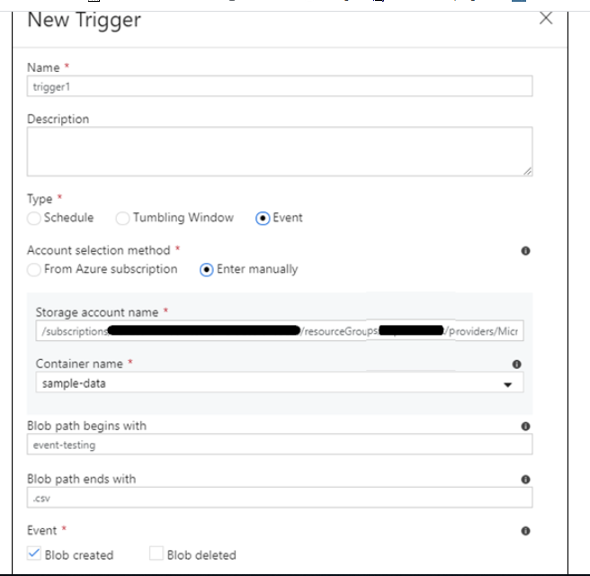

### Azure Data Factory

#### Introduction

ADF is a serverless data integration cloud based service which is used for Data movement and Data transaformation activites.

Using ADF we can define the data flow(Data pipeline) for the process.

[Trigger][Trigger]

#### Trigger

Trigger is used to invoke a pipeline at the specified time or event.

##### Event Based trigger

Event based trigger is used to trigger the pipeline based upon the event,lets say arrival or deletion of a file in the storage account.

##### Schedule Based trigger

Schedule Based tirgger is used to invoke a pipeline based on specified time.We suppose to give start datetime, recurrence(minute/hour/daily/weekly) and end datetime if we required.

